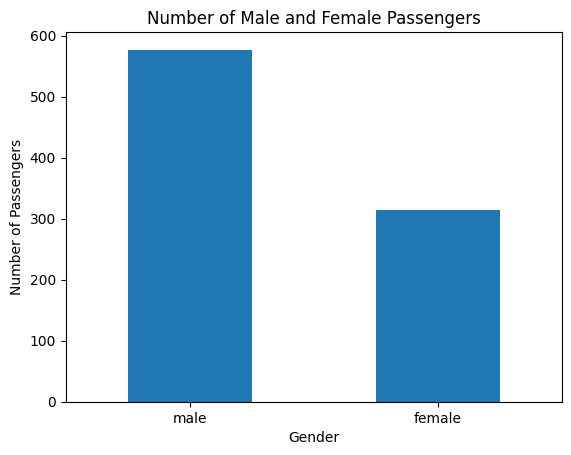
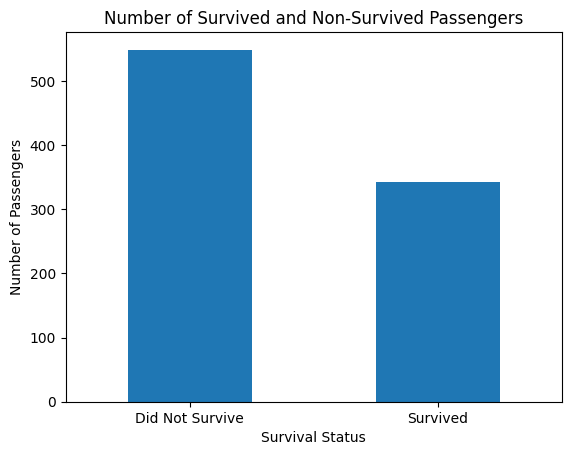
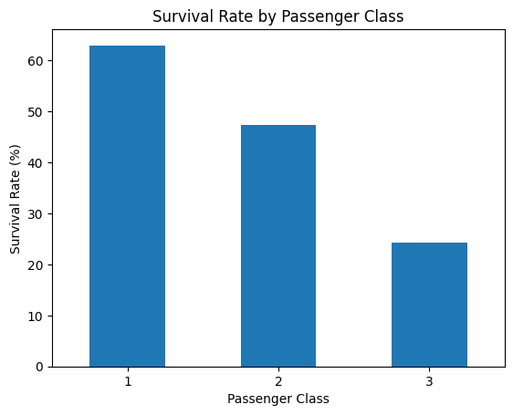
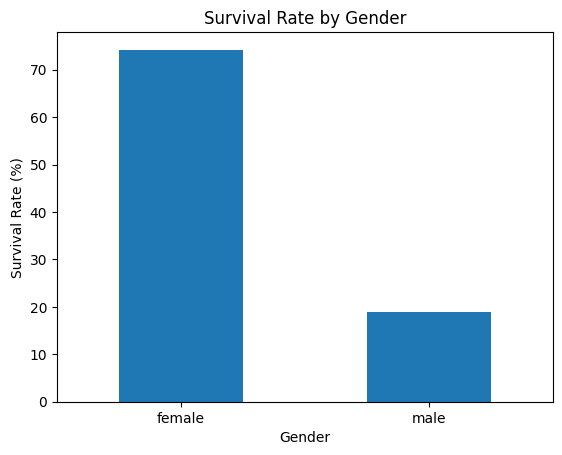

# 🚢 Titanic Data Analysis

A practical data analysis project exploring passenger demographics and survival patterns in the Titanic dataset using Python, NumPy, Pandas, and Matplotlib.

## 📌 Project Overview

This project analyzes the Titanic passenger dataset to understand the factors associated with passenger survival. The analysis covers data inspection, missing-value handling, feature creation, statistical summaries, and visualizations.

The notebook works with **891 passenger records and 12 original columns** and investigates survival patterns across passenger class, gender, age groups, and family size.

## 🛠️ Technologies Used

- Python
- NumPy
- Pandas
- Matplotlib
- Jupyter Notebook / Google Colab

## 📂 Dataset

The project uses `Titanic-Dataset.csv`.

The original dataset contains 891 passenger records with fields including:

- PassengerId
- Survived
- Pclass
- Name
- Sex
- Age
- SibSp
- Parch
- Ticket
- Fare
- Cabin
- Embarked

## 🔎 Data Preparation

The notebook includes several data-quality steps:

- Inspected the dataset structure and data types.
- Checked for missing values.
- Filled **177 missing Age values** using the median age of **28 years**.
- Filled **2 missing Embarked values** using the mode, which was `S`.
- Checked for duplicate rows and found **0 duplicate records**.
- Removed the `Cabin` column because approximately **77.10%** of its values were missing.
- Created a `FamilySize` feature using `SibSp + Parch + 1`.
- Created an `AgeGroup` feature with four categories: Child, Teenager, Adult, and Senior.

## 📊 Analysis

The project answers practical questions about the dataset, including:

1. How many passengers were on the Titanic?
2. How many male and female passengers were there?
3. How many passengers survived?
4. What percentage of passengers survived?
5. What was the average passenger age?
6. What was the average fare?
7. Which passenger class was most common?
8. What was the survival rate for each passenger class?
9. What was the survival rate for each gender?
10. How were survival rates distributed across family sizes and age groups?

## 📈 Key Results

| Metric | Result |
|---|---:|
| Total passengers | 891 |
| Male passengers | 577 |
| Female passengers | 314 |
| Survived | 342 |
| Did not survive | 549 |
| Overall survival rate | 38.38% |
| Average age | 29.36 years |
| Average fare | 32.20 |
| Most common class | 3rd Class (491 passengers) |

### Survival Rate by Passenger Class

| Passenger Class | Survival Rate |
|---|---:|
| 1st Class | 62.96% |
| 2nd Class | 47.28% |
| 3rd Class | 24.24% |

### Survival Rate by Gender

| Gender | Survival Rate |
|---|---:|
| Female | 74.20% |
| Male | 18.89% |

### Age Group Analysis

| Age Group | Passengers | Survival Rate |
|---|---:|---:|
| Child | 69 | 57.97% |
| Teenager | 95 | 41.05% |
| Adult | 701 | 36.52% |
| Senior | 26 | 26.92% |

### Family Size Analysis

The notebook calculates survival rates by family size. The observed rates range from **72.41% for family size 4** to **0% for family sizes 8 and 11** in this dataset.

## 📸 Visualizations

### Passenger Gender Distribution



### Survival Status



### Survival Rate by Passenger Class



### Survival Rate by Gender



## 💡 Main Findings

- The dataset contains 891 passengers, with more male passengers than female passengers.
- 342 passengers survived, while 549 did not, giving an overall survival rate of 38.38%.
- First-class passengers had the highest survival rate at 62.96%.
- Third-class passengers had the lowest survival rate at 24.24%.
- Female passengers had a substantially higher survival rate than male passengers: 74.20% compared with 18.89%.
- Children had the highest survival rate among the defined age groups at 57.97%, while seniors had the lowest at 26.92%.
- Passenger class and gender showed clear differences in survival rates within this dataset.

## ▶️ How to Run

### 1. Clone the repository

```bash
git clone <your-repository-url>
cd Titanic_Data_Analysis
```

### 2. Install dependencies

```bash
pip install numpy pandas matplotlib jupyter
```

### 3. Open the notebook

```bash
jupyter notebook Titanic_Data_Analysis_project.ipynb
```

You can also open the notebook directly in Google Colab.

## 📁 Project Structure

```text
Titanic_Data_Analysis/
│
├── Titanic-Dataset.csv
├── Titanic_Data_Analysis_project.ipynb
├── README.md
│
└── assets/
    ├── passenger_gender.png
    ├── survival_status.png
    ├── survival_by_class.png
    └── survival_by_gender.png
```

## 👨‍💻 Author

**Maham Jabbar**

This project demonstrates practical experience with data inspection, cleaning, feature creation, aggregation, and data visualization using Python.
